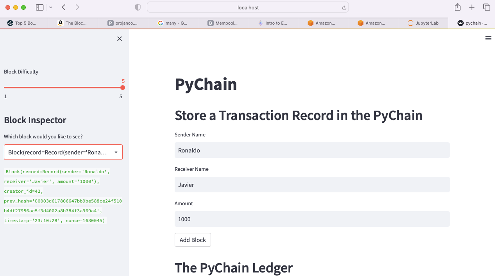
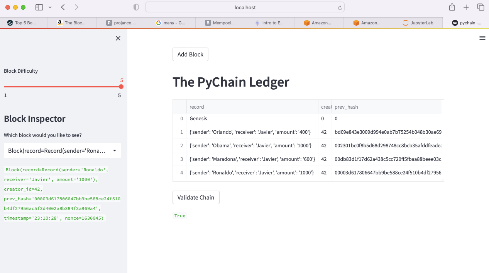

# FinTech_Blockchain_Unit18
Assignment for Blockchain

## Streamlit apllication
### PyChain
Setting Block Difficulty, Storing a Transaction Record and adding a Block

### PyChain Ledger
Display the PyChain Ledger
Validate Chain

